# 야! 밥한번 먹자
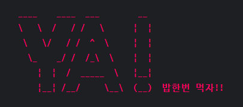

### 프로젝트 소개
- 주제 : TO-DO List CLI 프로그램
  - 비트캠프 미니프로젝트 2
  - 개인 및 지인들과의 밥약속 일정을 관리하는 프로그램
- 개발기간 : 2024-07-01 ~ 2024-07-05


### 개발팀
- (NAVER Cloud) 클라우드 기반 웹 데브옵스 프로젝트 개발자 과정 14기
- 공통 : 설계, 테스트, 리팩터링
- chocolithm (algo-itthm)
  - User(사용자) / Plan(일정) 기능 구현
  - Appointment(약속추가) 기능 공동 구현
- SA030
  - Login / Menu / Prompt(공통출력) 기능 구현
  - Appointment(약속추가) 기능 공동 구현
  - TUI 및 Dummy Data

<!-- 
  프로젝트 로고, 배포 주소
https://velog.io/@luna7182/%EB%B0%B1%EC%97%94%EB%93%9C-%ED%94%84%EB%A1%9C%EC%A0%9D%ED%8A%B8-README-%EC%93%B0%EB%8A%94-%EB%B2%95
 -->


<br><br>
# 시작 가이드

### Requirements
- JDK 21

### Installation
```
$ git clone "https://github.com/chocolithm/bitcamp-project2"
$ cd bitcamp-project2
```

### Run
```
$ java -cp app/bin/main bitcamp.project2.App
```

<!-- Backend, Frontend -->


<br><br>
# 기술 스택
<!-- https://github.com/Ileriayo/markdown-badges?tab=readme-ov-file#badges -->

### Environment


### Development


### Communication

<!-- 상황에 따라 config, test, deploy 등 추가 -->


<br><br>
# 주요 기능

### 개인 일정 관리
- 제목, 기간, 필요시 반복요일 설정을 통해 일정 관리 가능

### 약속 추가 기능 제공
- 여러 사용자간 일정이 비어있는 시간을 계산하여 목록으로 제공


<br><br>
# 화면 구성

### 회원가입
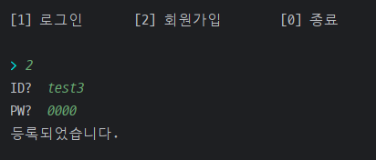

### 로그인
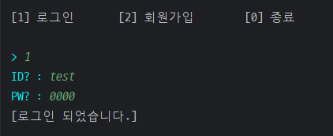

### 메인 페이지
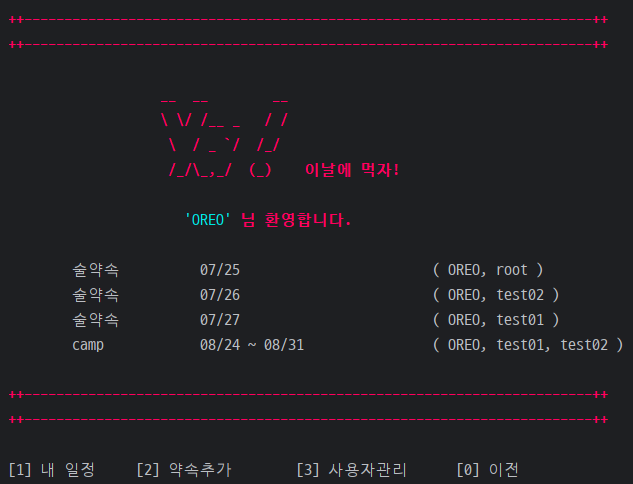

### 내 일정
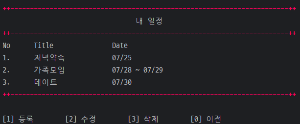

- 등록


- 수정
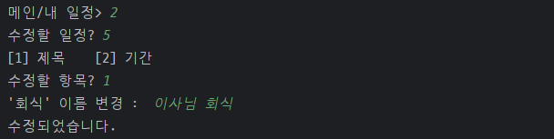

- 삭제
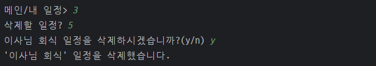

### 약속추가
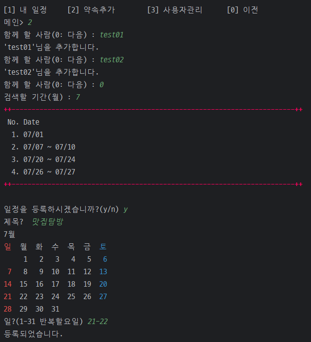

### 사용자관리
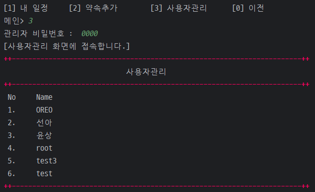

- 수정
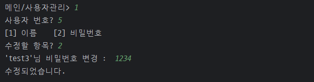

- 삭제
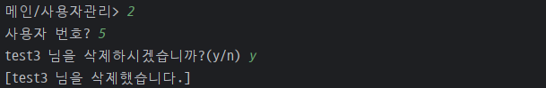


<!-- 아키텍쳐 구조, 개발 일지, 회고 블로그 링크 -->