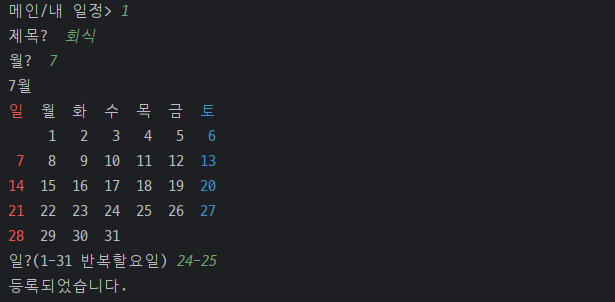

# 야! 밥한번 먹자


### 프로젝트 소개
- 주제 : TO-DO List CLI 프로그램
  - 비트캠프 미니프로젝트 2
  - 개인 및 지인들과의 밥약속 일정을 관리하는 프로그램
- 개발기간 : 2024-07-01 ~ 2024-07-05
<!-- 이후 UI, 기능 분리 -->


### 개발팀
- (NAVER Cloud) 클라우드 기반 웹 데브옵스 프로젝트 개발자 과정 14기
- 공통 : 설계, 테스트, 리팩터링
- chocolithm (algo-itthm)
  - User(사용자) / Plan(일정) 기능 구현
  - Appointment(약속추가) 기능 공동 구현
- SA030
  - Login / Menu / Prompt(공통출력) 기능 구현
  - Appointment(약속추가) 기능 공동 구현
  - TUI 및 Dummy Data

<!-- 
  프로젝트 로고, 배포 주소
https://velog.io/@luna7182/%EB%B0%B1%EC%97%94%EB%93%9C-%ED%94%84%EB%A1%9C%EC%A0%9D%ED%8A%B8-README-%EC%93%B0%EB%8A%94-%EB%B2%95
 -->


<br><br>
# 1. 시작 가이드

### Requirements
- JDK 21

### Installation
```
$ git clone "https://github.com/chocolithm/bitcamp-project2"
$ cd bitcamp-project2
```

### Run
```
$ java -cp app/bin/main bitcamp.project2.App
```

<!-- Backend, Frontend -->


<br><br>
# 2. 기술 스택
<!-- https://github.com/Ileriayo/markdown-badges?tab=readme-ov-file#badges -->

### Environment


### Development


### Communication

<!-- 상황에 따라 config, test, deploy 등 추가 -->


<!-- 채택한 개발 기술과 브랜치 전략 -->

<br><br>
# 3. 프로젝트 구조
<pre>
📦src
 ┣ 📂main
 ┃ ┣ 📂java
 ┃ ┃ ┗ 📂bitcamp
 ┃ ┃ ┃ ┗ 📂project2
 ┃ ┃ ┃ ┃ ┣ 📂controller
 ┃ ┃ ┃ ┃ ┃ ┣ 📜AppointmentController.java
 ┃ ┃ ┃ ┃ ┃ ┣ 📜PlanController.java
 ┃ ┃ ┃ ┃ ┃ ┗ 📜UserController.java
 ┃ ┃ ┃ ┃ ┣ 📂util
 ┃ ┃ ┃ ┃ ┃ ┣ 📜Membership.java
 ┃ ┃ ┃ ┃ ┃ ┣ 📜Menu.java
 ┃ ┃ ┃ ┃ ┃ ┗ 📜Prompt.java
 ┃ ┃ ┃ ┃ ┣ 📂vo
 ┃ ┃ ┃ ┃ ┃ ┣ 📜Plan.java
 ┃ ┃ ┃ ┃ ┃ ┗ 📜User.java
 ┃ ┃ ┃ ┃ ┣ 📜App.java
 ┃ ┃ ┃ ┃ ┗ 📜DummyData.java
 ┃ ┗ 📂resources
 ┃ ┃ ┗ 📜README.md
 ┗ 📂test
 ┃ ┣ 📂java
 ┃ ┃ ┗ 📂bitcamp
 ┃ ┃ ┃ ┗ 📂project2
 ┃ ┃ ┃ ┃ ┗ 📜AppTest.java
 ┃ ┗ 📂resources
 ┃ ┃ ┗ 📜README.md
</pre>

<br><br>
# 4. 주요 기능

### 개인 일정 관리
- 제목, 기간, 필요시 반복요일 설정을 통해 일정 관리 가능

### 약속 추가 기능 제공
- 여러 사용자간 일정이 비어있는 시간을 계산하여 목록으로 제공


<br><br>
# 5. 화면 구성 및 기능

### 회원가입
- ID 입력 시 중복 검사가 진행되고, 중복일 경우 경고 문구를 출력합니다.
- 중복 검사를 통과할 경우 비밀번호를 입력받은 후 가입을 완료합니다.


### 로그인
- ID를 입력받은 후, 해당하는 ID가 없으면 경고 문구를 출력합니다.
- ID가 일치하면 PW를 입력받은 후, 일치하면 로그인에 성공하여 메인으로 이동합니다.


### 메인
- 메인화면 로고 하단에 약속 목록을 출력합니다.
- 번호를 통해 각 메뉴로 이동할 수 있습니다.


### 내 일정
- 등록되어 있는 개인 일정 목록을 출력합니다.
- 번호를 통해 각 메뉴로 이동할 수 있습니다.


[등록]
- 제목과 약속을 잡을 월을 입력받은 후, 해당 월의 달력을 출력합니다. (연도는 2024 고정)
- 달력을 참고하여 원하는 날짜나 기간, 필요하면 반복할 요일을 dd-dd day 형식으로 입력하여 등록합니다.



[수정]
- 수정할 일정 및 항목을 선택한 후 재설정합니다.


[삭제]
- 삭제할 일정을 선택하면 1회 재확인 후 삭제합니다.


### 약속추가
- 여러 사용자를 입력한 후, 약속이 가능한 기간을 계산하는 출력하는 기능입니다.
- '함께 할 사람'과 '검색할 기간'을 입력하면, 해당 월에서 입력받은 사용자가 모두 약속이 가능한 일정을 목록으로 보여줍니다.
- 이후 일정을 바로 등록하고자 한다면 y 및 기간을 입력하여 등록합니다.


### 사용자관리
- 관리자 비밀번호를 확인한 후, 비밀번호가 일치하면 사용자관리 화면으로 이동합니다.
- 사용자에 대한 수정, 삭제를 수행할 수 있습니다.


[수정]
- 수정할 사용자 및 항목을 선택한 후 재설정합니다.


[삭제]
- 삭제할 사용자를 선택하면 1회 재확인 후 삭제합니다.
- 삭제한 사용자는 메인 화면의 약속 목록에서 사라집니다.
- 로그인한 사용자 본인을 삭제하려 하면 경고 문구를 출력합니다.


<!-- 아키텍쳐 구조, 개발 일지, 회고 블로그 링크, 트러블 슈팅, 개선 목표, 후기 -->
